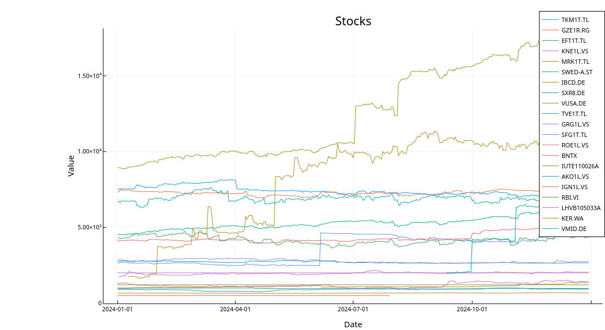
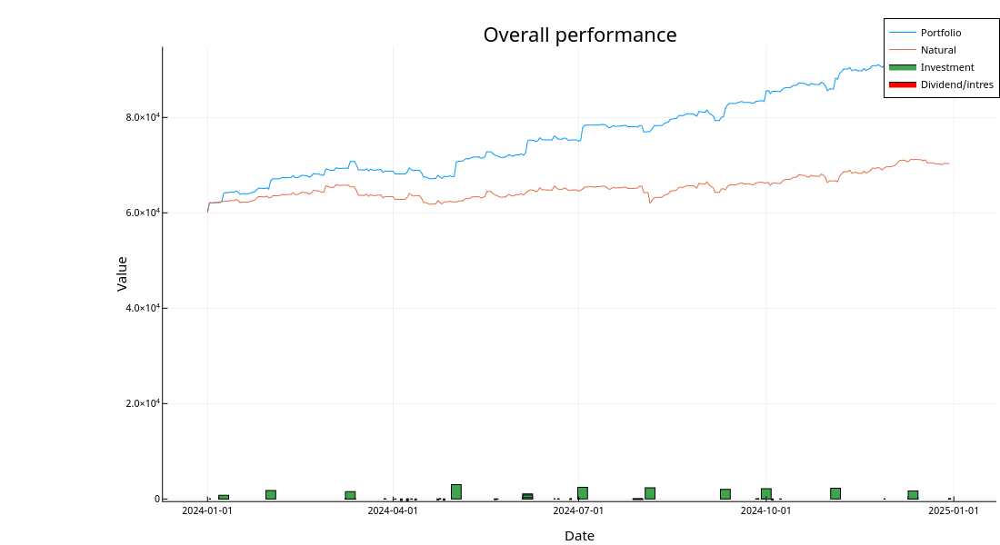
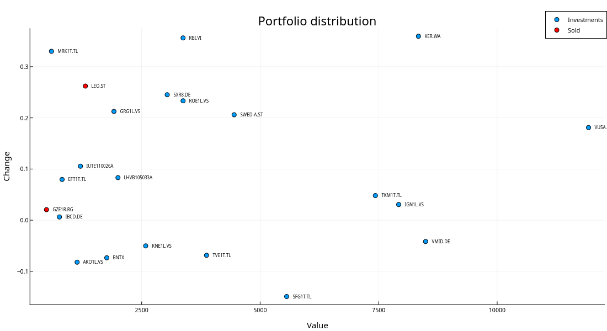

+++
title = "2024 Investment portfolio recap"
summary = "Analysis of portfolio performance in 2024."
template = "page.html"
date = 2025-07-20T15:00:00Z
+++

2024 was a bit more stable year once again.
The inflation in Estonia stayed at ~3.5%, so at relatively low level compared to how much money has been printed.
SP500 was mostly going sideways with slight gains in the first half of the year, but picked up the pace with strong gains the second half.

# Trades
I started the year by continuing with the plan of profiting from the war in Ukraine.
Namely, I bought KER.WA (Kernel Holdings) that is the biggest corn producer in Ukraine.
The stock seemed very cheap compared to fundamentals (which are super uncertain cuz of war of course).
This seemed to pay of quite well in the second half of the year when I was too afraid to put more money into that and started investing
in the indexes again.

Performance of each stock I had can be seen in the Figure below.

# Dividends and interests

For the 2024 I had a goal of getting 2500€ passive income.
I managed to achieve that by earning whopping 2.8k € which is slightly more than the target was.
Most of it came from the stocks I already had brought previously as I mainly bought growth stocks this year.

Small loans at [omaraha.ee](https://omaraha.ee/et/) made a small rebound by earning ~95€ profit which is ~15% gains.
Fine for this year, but considering the poor performance from past it is still not worth it.

# Other investments
#### Crypto
Crypto kept making gains so now I'm back on the plus side, but as the total amount invested is low, it's nothing compared to rest of the portfolio.

#### Options
Didn't do anything again as all the money I had left went to saving for apartment.

# Overall performance
Overall I invested ~23.6k € while the portfolio increased by 33.7k € so in total the year resulted in a profit of 10.1k €.
During the year the dividend yield decreased to 3.7% which is expected as I focused more on growth stocks.

The overall performance as well as money put in and taken out (dividends) can be seen in the Figure below.

# Portfolio distribution
Here is the overview of my portfolio as of 31st December 2024.
From the Figure below we can see that RBI has kept its pace, but was also joined with Merko and KER.
Last of them I also decided to bet on bigger, so the total wins are affected by it quite a bit.

Sadly quite many of the Estonian companies are struggling due to bad economical politics and are still on the negative side.

# Key indicators
**Profit:** 10.1k €  
**Profit %:** 13.2%  
**Real profit %:** 9.7%  
**Invested:** 23.6k €  
**Dividends:** 2.8k €  
**Dividend yield:** 3.7%  
**Standard deviation:** 3.1%

# Goals
2024 - 90k  
2025 - 120k  
2026 - 145k  
2027 - 175k
